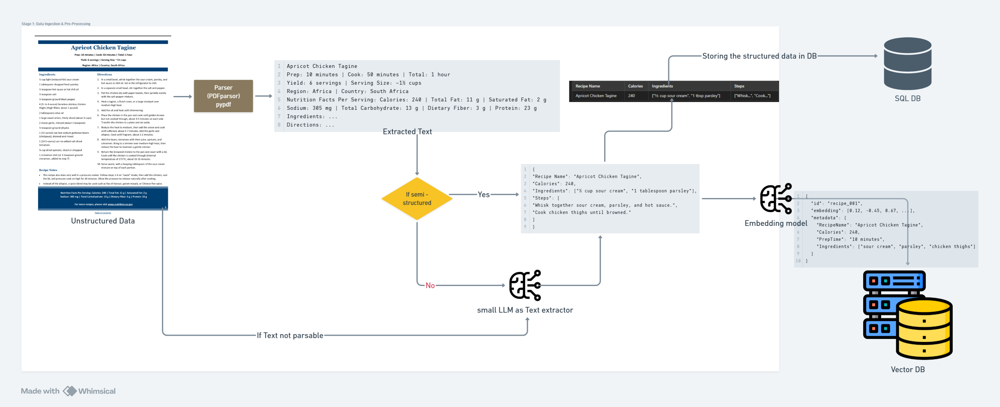

# Efficient Reasoning with Agentic RAG for Unstructured and Tabular Data

**Goal:**  
The primary objective of this document is to address the limitations of standard RAG systems when handling queries that involve numerical reasoning, using the recipe book example as a case study. The goal is to build a system that can efficiently answer queries like "Give me the recipe with the lowest calories" without significantly impacting response times.
This will involve a combination of data preprocessing, structured storage, and intelligent query routing to optimize the LLM's performance in handling numerical analysis and comparisons using agent-based tools and structured data retrieval mechanisms.

**Key Stages:**
1. **Data Ingestion & Pre-processing (Stage 1)**: Extracting and converting raw, unstructured or semi-structured data (e.g., PDFs, scanned documents, emails, HTML pages) into a consistent, structured format such as CSV or JSON. Standardizing and normalizing the data for efficient storage and retrieval and storing it in a structured database or index.  
2. **Query Understanding & Routing (Stage 2)**: Interpreting the user’s input, determining whether to use an LLM (and do standard RAG processing) or direct it to an agent (tool) for specialized operations, and refining queries through Chain-of-Thought or further user disambiguation if needed.  
3. **Agent Execution (Stage 3)**: If required, calling an external tool/agent to process or retrieve additional information, perform computations, or run domain-specific logic.  
4. **Response Generation (Stage 4)**: Integrating the agent’s output back into the primary LLM’s context and producing a coherent, user-friendly answer.

---

## Stage 1: Data Ingestion & Pre-Processing 
This stage of pipeline will be a preprocessing layer that will convert unstructured or semi-structured data into a structured format that can be efficiently stored and queried by the subsequent stages of the system. This will involve extracting data from various sources such as PDFs, scanned images, and free-text documents, cleaning and normalizing the extracted data, and structuring it in a way that facilitates easy retrieval and analysis.
This will run independently in the background, ensuring that the data is always ready for the subsequent stages to process.

<p align="center">
  
</p>


**Proposed Approaches and Tools:**

1. **Data Extraction from PDFs and Other Non-Text Formats**  
   - **Direct PDF Parsing (If Non-Scanned, Selectable Text PDFs)**:  
     Use libraries such as `Pypdf`, `pdfplumber`, or `PDFMiner` to extract text directly from PDF documents.  
     - **Pros:** Can directly extract text with structure (e.g., headings, paragraphs, tables if identifiable).  
     - **Cons:** Complex layouts (like tables embedded in PDFs) may require custom logic or additional parsing. 
   
   - **Optical Character Recognition (OCR) for Scanned Documents**:  
     If documents are scanned images or non-selectable PDFs, use OCR tools like `Tesseract` to convert images into text.  
     - **Pros:** Can handle scanned documents and images, making them searchable.  
     - **Cons:** OCR may introduce transcription errors; might require post-processing to improve text quality.
   
   - **Supplementary Format Parsers (e.g., HTML, Emails, CSV)**:  
     For HTML sources, use `BeautifulSoup` or `lxml` to extract textual content and structured data (such as tables). For CSVs or TSVs, direct ingestion into a structured format is straightforward.  
     - **Pros:** Straightforward parsing, especially for inherently semi-structured formats.  
     - **Cons:** HTML might still need cleaning and semantic interpretation.
  


2. **Pre-processing & Normalization**  
   After extracting raw text, additional steps ensure data consistency and quality:  
   - **Cleaning & Tokenization:** Remove non-ASCII characters, fix encoding issues, and tokenize text for further analysis.  
   - **Normalization & Stemming/Lemmatization:** Convert text to a consistent lowercase format, remove stopwords, and apply stemming or lemmatization if needed for downstream NLP tasks.  
   - **Document Segmentation:** Break long documents into smaller, logical sections (e.g., chapters, sections, paragraphs) for more efficient storage and retrieval later.
   
3. **Extracting Structured Information from Unstructured Text**  
   There are generally three main approaches depending on the complexity and nature of the input:
   
   a. **Rule-Based/String Manipulation:**  
      If the document follows a predictable semi-structured pattern (e.g., delimited fields, consistent headings, or known patterns), use regex or custom parsing logic.  
      for example:
   
      ```python
        import re
        pattern = r"Recipe Name: (.*)\nCalories: (\d+)"
        match = re.search(pattern, text)
        recipe_name, calories = match.groups()
    ```
      - **Pros:** Fast, transparent, and does not require heavy computational resources.  
      - **Cons:** Fragile when dealing with variable formatting; may not generalize well to new formats.
   
   b. **Schema Induction Using Small or Specialized LLMs:**  
      When data is fully unstructured, or if we need to automatically infer a schema, use a lightweight LLM or a fine-tuned model to parse the text and output structured data (e.g., JSON with defined keys). For example:  
      - **Prompt the LLM:** "Extract all purchase orders from the text and output them as a JSON array with fields: order_id, customer_name, product, quantity."  
      - LLM would respond with a structured representation, greatly simplifying downstream indexing.
      
      - **Pros:** Flexible, can adapt to many formats, and reduces the need for manual rule creation.  
      - **Cons:** Might require careful prompt design, may incur latency and cost, and may need multiple iterations for complex data.
   
   c. **Hybrid Approaches (LLM + Heuristics):**  
      Combine rule-based extraction for known patterns with LLM-based extraction for more ambiguous parts. For example, use regex to identify sections and pass each section to an LLM to clarify field assignments.
      
      - **Pros:** Balances the speed and reliability of rule-based methods with the flexibility of LLMs.  
      - **Cons:** Slightly more complex to implement and maintain.
   
5. **Data Validation & Quality Control**  
   Once a preliminary structured output is produced, apply validation checks:  
   - **Schema Validation:** Verify that the structured data adheres to the defined schema (all required fields present, correct data types, etc.).  
   - **Deduplication & Consistency Checks:** Remove duplicate records and ensure there are no conflicting entries.  
   - **Error Handling:** In case of missing or malformed data, log errors or raise alerts for manual review.

6. **Storing the Structured Data**  
   Depending on the use case and query patterns, consider suitable storage solutions:  
   - **Relational Databases (e.g., PostgreSQL, MySQL):** For tabular data with well-defined schemas.  
   - **NoSQL Databases (e.g., MongoDB, Elasticsearch):** For flexible schemas and quick full-text search.  
   - **Vector Databases or Document Stores (e.g., Pinecone, Weaviate, Qdrant):** If we plan to leverage embeddings for semantic search at a later stage.
   
   **Pros:** Structured and indexed data enables fast queries and easier downstream analysis.  
   **Cons:** Choosing the right database requires analyzing query patterns, scalability needs, and data complexity.


### Example flow
Input Example (Unstructured Data):

```
Apricot Chicken Tagine
Prep: 10 minutes | Cook: 50 minutes | Total: 1 hour
Yield: 6 servings | Serving Size: ~1½ cups
Region: Africa | Country: South Africa
Nutrition Facts Per Serving: Calories: 240 | Total Fat: 11 g | Saturated Fat: 2 g
Sodium: 305 mg | Total Carbohydrate: 13 g | Dietary Fiber: 3 g | Protein: 23 g
Ingredients: ...
Directions: ...
```

Example structured data representation:

```json
{
"Recipe Name": "Apricot Chicken Tagine",
"Calories": 240,
"Ingredients": ["½ cup sour cream", "1 tablespoon parsley"],
"Steps": [
    "Whisk together sour cream, parsley, and hot sauce.",
    "Cook chicken thighs until browned."
]
}
```

Output Example of data stored in a database:

| Recipe Name            | Calories | Ingredients                            | Steps                   |
| ---------------------- | -------- | -------------------------------------- | ----------------------- |
| Apricot Chicken Tagine | 240      | ["½ cup sour cream", "1 tbsp parsley"] | ["Whisk...", "Cook..."] |

### Optimizations and Considerations for Stage 1:
- **Batch Processing:** If dealing with large volumes of documents, ensure efficient batch OCR, parsing, and LLM calls.  
- **Caching Results:** Cache results of expensive OCR or LLM operations to avoid repeated processing.  
- **Feedback Loop:** Integrate a review loop where users or experts can correct and refine structured outputs, improving system accuracy over time.  
- **Testing and Iteration:** Begin with a small sample of documents, refine parsing rules or LLM prompts, and gradually scale up.
- **Error Handling:** Implement validation for extracted fields using predefined rules (e.g., calories should be numeric, preparation time should follow standard time units).

### Additional Considerations | Vector Database Integration:
In addition to storing structured outputs (e.g., JSON format) in a SQL database, we will store embeddings of the structured JSON objects in a **Vector Database** (e.g., Pinecone, Weaviate, Qdrant) to enable **semantic search** for standard RAG queries. Metadata such as recipe name, calorie count, and preparation time will be included alongside the embeddings to facilitate hybrid filtering during query resolution.

1. **Embedding Generation**:  
   - Convert the structured JSON data into dense vector embeddings using an embedding model like `OpenAI’s text-embedding-ada-002` or `Hugging Face Sentence Transformers`.  
   - Store these embeddings along with the metadata for each recipe in the vector database.

2. **Metadata Storage**:  
   - Attach key fields such as `RecipeName`, `Calories`, `PrepTime`, and `Ingredients` as metadata in the vector database.  
   - Example entry in vector database:
     
     ```json
     {
       "id": "recipe_001",
       "embedding": [0.12, -0.45, 0.67, ...],
       "metadata": {
         "RecipeName": "Apricot Chicken Tagine",
         "Calories": 240,
         "PrepTime": "10 minutes",
         "Ingredients": ["sour cream", "parsley", "chicken thighs"]
       }
     }
     ```

3. **Dual Storage**:
   - **SQL Database**: For exact matching, filtering, and numerical operations (e.g., lowest calorie).  
   - **Vector Database**: For semantic search and similarity-based retrieval.  

4. **Optimized Query Handling**:  
   - This dual-storage strategy allows the system to dynamically choose between:  
     - **Standard Vector Search RAG**: For natural language queries (e.g., "Find me a creamy chicken recipe").  
     - **SQL Database Search**: For numerical, comparison-based, or structured queries (e.g., "What is the lowest-calorie recipe?").

---

## Stage 2: Query Understanding & Routing

In this stage, the system focuses on accurately understanding user queries, determining the appropriate execution path, and ensuring efficient resolution. Queries will be categorized into **semantic search**, **numerical reasoning**, and **agent-based tasks**, enabling optimal performance by leveraging dual storage strategies (SQL Database and Vector Database with embeddings).

**Objective:**
To efficiently interpret, classify, and route user queries to the appropriate processing mechanism:  
1. **Vector Search (Standard RAG)** for natural language queries or semantic searches.  
2. **Agent-Based Execution like text-to-SQL or specialized tools**  for structured queries involving exact matches, filtering, and numerical reasoning.  

The system will dynamically determine which path to follow based on query classification and user intent.

### **Steps to Implement**  

#### **Step 1: Query Understanding and decompostion**
   1. **Natural Language Understanding (NLU):** Perform semantic parsing of the query to extract intent, entities, and context.

  1. **CoT (Chain of Thought) Reasoning:** Implement step-by-step reasoning for complex queries using CoT techniques. This helps the model explain its understanding and reasoning process.

  2. **Intent Detection:** Classify queries into predefined intents or categories (e.g., retrieve data, update records, perform calculations, etc.).

- **Tools**: We can either do few shot promting in the primary LLM or fine-tune (or train) a separate model for intent classification.

**Example Query Parsing**:  
Input:  
> "Find the recipe with the lowest calories and quick prep time."

**Output**:  

```json
{
  "Intent": "Find Lowest",
  "Attribute": ["Calories", "PrepTime"],
  "Condition": ["Minimum", "<30 minutes"],
  "EntityType": "Recipe"
}
```

#### **Step 2: Decision-Making for Agent Invocation**
1. **Primary LLM-Based Decision Making:**
   - Use the LLM to decide if the query requires calling an external agent (API, database, custom function, etc.) or can be resolved natively.
   - Employ zero-shot reasoning or a prompt template like:
     
     ```
     Given the user query: [QUERY]
     Is this a high-complexity query requiring external tools, or can it be resolved within the current context? Respond with "Agent Required" or "No Agent Required."
     ```

2. **Routing Logic:**
   - **If Decided:** Route to the appropriate agent/tool directly.
   - **If Undecided:** Pass the query to a specialized triage LLM agent for further clarification.


#### **Step 3: Triage for Ambiguous Queries**
1. **Query Clarification via Triage Agent:**
   - Use an intermediate LLM (triage agent) that asks follow-up questions to resolve ambiguities. Example:
     
     ```
     The query "[QUERY]" is ambiguous. Please clarify:
     - [Option 1]
     - [Option 2]
     - [Other]
     ```

2. **Fallback Mechanism:**
   - If the triage agent cannot determine the next step, flag the query as unresolved and notify the user or administrator.


#### **Step 4: Response Handling**
1. **Successful Routing:**
   - Forward the agent's response back to the primary LLM for generating a coherent, user-friendly response.
   - Incorporate a predefined template or framework for structured responses.

2. **Failure Handling:**
   - Notify the user of failure to resolve the query and provide actionable suggestions, e.g., alternative query phrasing.


3. **Trigger LLM for Ambiguous Queries**  
   If the query is ambiguous or lacks clarity, the system triggers a **Clarification LLM** to interact with the user and refine the query.

   **Example**:  
   Query: "Show me the best recipe."  
   - Clarification Prompt:  
     > "By 'best recipe,' do you mean the one with the lowest calories, quickest prep time, or highest protein content?"  

   - Refined Query:  
     > "Lowest calories."

   - Route query to **SQL Execution**.


#### **Example Workflow**  
For multi-condition queries that involve both **semantic search** and **structured operations**:  
- Perform **Vector Search** first for semantic similarity.  
- Apply **post-processing filters** using SQL or Python tools for numerical reasoning.

**Example Query**:  
> "Find chicken recipes under 300 calories."

**Execution Steps**:  
1. **Query Parsing**:  
   - Extract intent, attributes, and conditions.  
   - Parsed Output:
     
     ```json
     {
       "Intent": "Find",
       "Entity": ["Recipe"],
       "Attributes": ["Calories < 300", "creamy"],
       "Condition": "Filter"
     }
     ```
2. **Query Routing**:
    - Route to Text-to-SQL agent for keyword-based search for "chicken" and under 300 calories in the SQL database.


### **Optimizations and Considerations for Stage 2**  

1. **Intent-Based Routing**:  
   - Use a lightweight intent classifier for fast decision-making.  
   - Optimize routing to minimize latency when switching between RAG and SQL execution.  

2. **Hybrid Search Efficiency**:  
   - Use metadata filtering in the vector database to reduce the number of candidate documents.  

3. **Caching Frequent Queries**:  
   - Cache results for common queries like "lowest calorie recipe" to avoid redundant computation. like KV cache or in-memory cache. 

4. **Error Handling**:  
   - Fallback to manual intervention or approximate results if the query cannot be resolved.  
   - Settting maximum number of iterations for CoT reasoning and triage to prevent infinite loops.

5. **Latency Optimization**:  
   - Use optimized embeddings and lightweight LLMs to minimize response time.

6. **Semantic Search based Text - to - SQL agent**:  
   - Implement a text-to-SQL agent that do both semantic search of embeddings and SQL query execution for metadata fields of vector database.

---

## Stage 3: Agent Execution

In this stage, the focus is on executing queries that require specialized tools or external computations. The primary goal is to efficiently retrieve, compute, or manipulate data as directed by the query routing logic in Stage 2. Once the query is routed to an agent, the system ensures accurate execution and delivers the processed result back to the primary LLM for response generation.

**Objective**:
To leverage agents or tools for:
1. **Executing text-to-SQL queries** for structured data stored in SQL databases.
2. **Performing numerical or analytical computations** for tasks requiring numerical reasoning.


### **Steps to Implement**

#### **Step 1: Query Translation & Execution**
1. **Text-to-SQL Translation**:
   - Use the LLM to generate SQL queries from natural language inputs for structured data retrieval.
   - Example query:
     
     ```
     "Find all recipes under 300 calories that use chicken."
     ```
     Decomposed Query from stage 2 for context:
     
     ```json
     {
       "Intent": "Find",
       "Entity": ["Recipe"],
       "Attributes": ["Calories < 300", "chicken"],
       "Condition": "Filter"
     }
        ```

     SQL Generated:

     ```sql
     SELECT * FROM Recipes 
     WHERE Calories < 300 AND Ingredients LIKE '%chicken%';
     ```
   - We can Utilize libraries like `LangChain` or `LlamaIndex` to integrate the text-to-SQL agent. or create a custom agent for this task with system prompt and few-shot examples.
   - System prompt as provided in LangChain:
     
        ```
        You are a SQLite expert. Given an input question, first create a syntactically correct SQLite query to run, then look at the results of the query and return the answer to the input question.
        Unless the user specifies in the question a specific number of examples to obtain, query for at most 5 results using the LIMIT clause as per SQLite. You can order the results to return the most informative data in the database.
        Never query for all columns from a table. You must query only the columns that are needed to answer the question. Wrap each column name in double quotes (") to denote them as delimited identifiers.
        Pay attention to use only the column names you can see in the tables below. Be careful to not query for columns that do not exist. Also, pay attention to which column is in which table.
        Pay attention to use date('now') function to get the current date, if the question involves "today".

        Use the following format:

        Question: Question here
        SQLQuery: SQL Query to run
        SQLResult: Result of the SQLQuery
        Answer: Final answer here

        Only use the following tables:
        {table_info}

        Question: {input}

        ```
    - We might also also want to validate the generated SQL query before execution to avoid errors. this can be done some using validation prompts or by using a SQL query validator library like `sqlparse`. The validation prompt will be like:
      
        ```
        Double check the user's {dialect} query for common mistakes, including:
        - Using NOT IN with NULL values
        - Using UNION when UNION ALL should have been used
        - Using BETWEEN for exclusive ranges
        - Data type mismatch in predicates
        - Properly quoting identifiers
        - Using the correct number of arguments for functions
        - Casting to the correct data type
        - Using the proper columns for joins

        If there are any of the above mistakes, rewrite the query.
        If there are no mistakes, just reproduce the original query with no further commentary.

        Output the final SQL query only.
        ```
     - We can also use a pre-trained model like `Tabert` for text-to-SQL translation as well fine-tune it on our specific domain like recipes.
        > **Note**: The fine-tuned model can not be as rialable as the sota llm models but but can be cost efficient if enough dataset is available.

1. **Semantic + SQL Query Execution**:
   - If the query involves semantic attributes (e.g., "creamy recipes"), perform a **hybrid retrieval**:
     - Use vector search to retrieve semantically relevant entries.
     - Filter the results with SQL for precise conditions (e.g., calories < 300).

2. **External Tool Execution**:
   - For tasks requiring computations (e.g., finding the average, minimum, or maximum values), execute custom Python scripts or external APIs.
   - Example:
     
     ```python
     import pandas as pd

     df = pd.DataFrame(data)  # Load query results
     result = df[(df['Calories'] < 300) & (df['Ingredients'].str.contains("chicken"))].min()
     ```

#### **Step 2: Agent-Orchestrated Execution**
1. **Agent Selection**:
   - Based on the query type identified in Stage 2, invoke the appropriate agent:
     - **SQL Agent** for structured queries.
     - **Computation Agent** for numerical analysis.
     - **API Agent** for domain-specific tools.

2. **Multi-Agent Coordination**:
   - For complex queries requiring multiple stages, chain agents together using a task pipeline.
   - Example:
     - Retrieve recipes using a vector database agent.
     - Pass the results to a numerical reasoning agent to compute averages or rankings.


#### **Step 3: Optimization Strategies**
1. **Caching for Repeat Queries**:
   - Store results of frequently requested queries in an **in-memory cache** (e.g., Redis) to reduce agent invocation latency.
   - Example: Cache results for "lowest calorie recipe" or "recipes with the shortest prep time."

2. **Batching and Precomputation**:
   - For computationally expensive tasks (e.g., computing aggregates), batch process queries during non-peak times.
   - Precompute and store results like top-10 recipes for common conditions (e.g., lowest calories, shortest prep time).

3. **Parallel Execution**:
   - For multi-step or multi-condition queries, run subtasks in parallel:
     - Example: Query both "recipes under 300 calories" and "recipes containing chicken" simultaneously, then merge results.

4. **Index Optimization**:
   - Use indices in the SQL database for frequently queried fields (e.g., `Calories`, `Ingredients`) to reduce execution time.

5. **Resource Management**:
   - Allocate lightweight agents for common queries and deploy compute-heavy agents for complex tasks only when needed.
   - Use containerized agents for scaling and fault tolerance.

---

### **Example Query Workflows**

#### **Workflow 1: Text-to-SQL Execution**
1. User Query: "Find the top 5 highest-protein recipes under 300 calories."
2. Steps:
   - Parse query and identify as a SQL task.
   - Generate SQL query:
     
     ```sql
     SELECT * FROM Recipes
     WHERE Calories < 300
     ORDER BY Protein DESC
     LIMIT 5;
     ```
   - Execute the SQL query and return results to the LLM for formatting.

#### **Workflow 2: Semantic + Numerical Analysis**
1. User Query: "Show me creamy recipes with the highest average protein."
2. Steps:
   - Use a vector search for semantic retrieval of "creamy" recipes.
   - Pass results to a Python-based agent for computing the average protein content and sorting by value.
   - Return the processed result to the LLM.

#### **Workflow 3: Hybrid Retrieval**
1. User Query: "What’s the lowest-calorie recipe with chicken and spinach?"
2. Steps:
   - Retrieve recipes semantically related to "chicken" and "spinach" using a vector database.
   - Apply SQL filters to find the one with the lowest calories.


### **Optimizations and Considerations**

1. **Error Handling**:
   - Implement retries for transient failures (e.g., API timeouts).
   - Log agent errors and fallback to approximate results where possible.

2. **Latency Management**:
   - Minimize overhead by using lightweight agents for trivial tasks.
   - Deploy serverless or containerized agents to scale based on demand.

3. **Security**:
   - Validate and sanitize dynamically generated queries to prevent SQL injection.
   - Restrict API access with authentication tokens and rate limiting.

4. **Resource Allocation**:
    - Monitor agent resource consumption and scale based on usage patterns.
    - Implement resource quotas to prevent runaway agents from consuming excessive resources.
    - Use serverless computing for cost-effective scaling.
    - Implement a timeout mechanism to prevent long-running queries from blocking resources.
    - Use a task queue to manage agent execution and prioritize tasks based on complexity.

5. **Feedback Loop, A/B Testing, and Monitoring**:
   - Collect user feedback on agent performance and incorporate improvements.
   - Conduct A/B testing to evaluate the effectiveness of different agents.
   - Monitor agent performance, latency, and resource utilization for optimization.

---

### Stage 4: Response Generation

In this final stage, the system integrates results from agents or tools back into the primary LLM’s context to generate a coherent, user-friendly response. The focus is on presenting actionable insights in natural language while optimizing for clarity, precision, and relevance to the user’s query.

To synthesize outputs from agents or tools into a natural, user-centric response by:
1. **Contextualizing results** within the query intent.
2. **Enhancing readability** with structured formats (e.g., tables, lists).
3. **Ensuring fallback and error handling mechanisms** to maintain user trust.


### **Steps to Implement**

#### **Step 1: Response Integration**
1. **Mapping Agent Results to User Intent**:
   - Parse the output of the agent/tool and structure it according to the query’s expected context.
   - Example:
     - **Input Query**: "Find the top 3 low-calorie chicken recipes."
     - **Agent Output**:
       
       ```json
       [
         {"Recipe": "Grilled Chicken Salad", "Calories": 150},
         {"Recipe": "Chicken Stir-Fry", "Calories": 200},
         {"Recipe": "Chicken Soup", "Calories": 250}
       ]
       ```
     - **Formatted Response**:
       > "Here are the top 3 low-calorie chicken recipes:
       > 1. Grilled Chicken Salad (150 calories)
       > 2. Chicken Stir-Fry (200 calories)
       > 3. Chicken Soup (250 calories)"

2. **Contextualizing Results**:
   - Provide additional insights or suggestions based on the query.
   - Example: For "What’s the lowest-calorie chicken recipe?" include preparation tips or related recipes in the response.

3. **Interactive Feedback**:
   - Allow users to refine or expand the query based on the response:
     - **Response**: "Grilled Chicken Salad is the lowest-calorie recipe at 150 calories. Would you like recipes with fewer ingredients or shorter prep time?"

---

#### **Step 2: Formatting the Response**
1. **Natural Language Output**:
   - Use LLM capabilities to convert raw outputs into well-phrased natural language.
   - **Prompt Template**:
     
     ```
     Given the query: [QUERY]
     And the results: [AGENT OUTPUT]
     Generate a concise, user-friendly response with suggestions if applicable.
     ```

2. **Structured Outputs**:
   - For numerical or tabular data, format the response into tables or bullet points for better readability.
   - Example:  
     **Input**: Query results with recipe details.  
     **Output**: A table with columns for Recipe Name, Calories, and Prep Time.

#### **Step 3: Error and Fallback Handling**
1. **Incomplete Results**:
   - If the agent fails to return complete data, respond with partial results and a fallback prompt.
   - Example: "I couldn’t find all the recipes under 300 calories. Would you like to expand the calorie limit?"

2. **Graceful Error Messaging**:
   - Inform users when a query cannot be resolved and suggest alternative approaches.
   - Example: "I couldn’t retrieve recipes for this query. Please try rephrasing or specifying fewer conditions."

#### **Step 4: Final Response Delivery**
1. **Conciseness**:
   - Avoid overloading the user with excessive information; summarize key points.

2. **Personalization**:
   - Tailor responses based on user preferences or prior interactions.
   - Example: "Since you often look for vegetarian recipes, here are some low-calorie options."


### Example Workflows

#### **Workflow 1: Text-to-SQL Response**
**Query**: "Find the top 5 highest-protein recipes under 300 calories."  
**Agent Output**:

```json
[
  {"Recipe": "Protein Shake", "Protein": 30, "Calories": 250},
  {"Recipe": "Grilled Salmon", "Protein": 25, "Calories": 290},
  {"Recipe": "Chicken Salad", "Protein": 20, "Calories": 200}
]
```
**Response**:
> "Here are the top 3 high-protein recipes under 300 calories:
> 1. Protein Shake: 30g protein, 250 calories.
> 2. Grilled Salmon: 25g protein, 290 calories.
> 3. Chicken Salad: 20g protein, 200 calories."

#### **Workflow 2: Hybrid Query Response**
**Query**: "Show me creamy recipes with the highest average protein."  
**Agent Outputs**:
- **Vector Search**: "Top matches: 'Creamy Alfredo Pasta', 'Creamy Chicken Soup'."
- **Numerical Computation**: "Average protein: 15g."
**Response**:
> "The highest-protein creamy recipes are:
> - Creamy Alfredo Pasta: 18g protein.
> - Creamy Chicken Soup: 12g protein.
> Would you like recipes with fewer calories?"


### **Optimizations for Stage 4**

1. **Dynamic Formatting**:
   - Adapt responses based on output type (text, table, or chart).

2. **Caching for Response Templates**:
   - Use pre-built templates for common queries to reduce generation time.

3. **Feedback Loop**:
   - Allow users to provide feedback on responses for continuous improvement.

---
## Optional Agent Considerations

In addition to the core agents described in **Stage 3**, certain optional agents can enhance the system’s capabilities for specific use cases. These agents are not essential for the baseline implementation but can add significant value for handling complex queries, improving reasoning, or enriching responses.


### **Graph Agent**  

**Objective**:  
The **Graph Agent** leverages a knowledge graph (KG) to manage queries requiring relationship-based reasoning or semantic connections between entities. This agent is particularly useful for questions that involve understanding shared attributes, hierarchies, or contextual links between recipes, ingredients, and nutritional information.


#### **Key Features of the Graph Agent**

1. **Relationship-Based Reasoning**:  
   - Enables querying of relationships between entities like recipes, ingredients, regions, and nutritional facts.
   - Example Queries:
     - "Find recipes similar to Apricot Chicken Tagine."
     - "What ingredients are common between Chicken Curry and Roasted Eggplant Spread?"

2. **Semantic Enrichment**:  
   - Provides additional context or insights by traversing the graph.  
   - Example: Linking regional cuisines to recipes (e.g., "Recipes from South Africa under 300 calories").

3. **Cross-Entity Analysis**:  
   - Handles multi-entity queries by identifying connections in the graph (e.g., shared ingredients or similar nutritional profiles).  
   - Example: "Show me recipes using ingredients similar to sour cream."


#### **Graph Agent Implementation**

1. **Graph Construction**:  
   - Build the graph from structured data ingested in **Stage 1**.
   - Nodes: Represent entities such as recipes, ingredients, and regions.  
   - Edges: Represent relationships like "contains," "belongs to," or "has calories."

   **Example Graph Representation**:
   - Nodes:  
     - Recipe: *Apricot Chicken Tagine*  
     - Ingredient: *Chicken*, *Sour Cream*  
     - Attribute: *Calories (240)*, *Region (South Africa)*  
   - Edges:  
     - *(Apricot Chicken Tagine) contains (Chicken)*  
     - *(Apricot Chicken Tagine) has (240 calories)*  
     - *(Apricot Chicken Tagine) belongs to (South Africa)*  

2. **Query Execution**:  
   - Use graph query languages like **Cypher** (Neo4j), **SPARQL**, or **Gremlin** to retrieve insights.  
   - Example Query: "Find recipes with chicken and fewer than 300 calories."  
     **Cypher Query**:  
     ```cypher
     MATCH (r:Recipe)-[:CONTAINS]->(i:Ingredient {name: 'Chicken'})
     WHERE r.calories < 300
     RETURN r.name, r.calories
     ```  

3. **Integration with Existing Agents**:  
   - Combine graph queries with SQL or semantic search for hybrid workflows.  
   - Example: Use the graph to identify similar recipes, then retrieve detailed data from the SQL database.


#### **Example Use Cases**

1. **Find Similar Recipes**  
   Query: "Show me recipes similar to Apricot Chicken Tagine."  
   **Graph Query**:  
   - Traverse the graph to identify recipes sharing two or more ingredients with *Apricot Chicken Tagine*.  
   - Output: *Chicken Curry* and *Tagine with Apricots and Almonds*.

2. **Regional Filtering**  
   Query: "What are South African recipes under 300 calories?"  
   **Graph Query**:  
   - Match recipes with `Region: South Africa` and `Calories < 300`.  

3. **Ingredient Analysis**  
   Query: "What are recipes containing ingredients similar to sour cream?"  
   **Graph Query**:  
   - Traverse relationships to find recipes containing *yogurt* or *cream cheese* as substitutes.  

---

### **Implementation Tools**

1. **Graph Database Solutions**:
   - **Neo4j**: For scalable, production-ready graph databases with Cypher queries.  
   - **Amazon Neptune**: Managed graph database for large-scale implementations.  
   - **RDF and SPARQL**: For semantic web-based graph processing.  
   - **GraphRAG**: A process involves extracting a knowledge graph out of raw text, building a community hierarchy, generating summaries for these communities, and then leveraging these structures when perform RAG-based tasks.

2. **Integration Frameworks**:
   - Use **LangChain** to integrate the Graph Agent into the overall pipeline.  
   - **GraphQL** APIs to enable seamless querying from the primary LLM.

#### **Optimizations for Graph Agent**

1. **Precomputed Relationships**:  
   - Cache commonly queried relationships (e.g., "recipes using chicken and spinach") to reduce latency.

2. **Hierarchical Queries**:  
   - Use graph traversals to handle hierarchical or category-based queries, like "Low-calorie recipes in African cuisine."

3. **Hybrid Workflows**:  
   - Use graph results to filter or refine SQL or vector search outputs.  
   - Example: Graph identifies relevant recipes, SQL computes aggregates (e.g., calorie averages).


#### **Potential Limitations**

1. **Data Volume**:  
   - Large graphs may require efficient indexing and distributed storage to handle scale.

2. **Latency**:  
   - Complex graph traversals may increase response times for deep queries.

3. **Data Integration**:  
   - Ensuring consistency between the graph and other data sources (SQL or vector database) may require periodic synchronization.

---

## **Conclusion**

The proposed multi-stage pipeline effectively addresses the challenges of handling complex queries by leveraging the strengths of LLMs and external agents. By integrating semantic understanding, numerical reasoning, and structured execution paths, the system ensures robust query handling and efficient response generation.

**Key Takeaways**:
1. **Scalable Design**: Combines SQL databases, vector embeddings, and hybrid query execution for versatility.
2. **Efficiency**: Uses caching, batching, and parallel execution to optimize resource utilization.
3. **User-Centric Approach**: Focuses on clarity, personalization, and error handling to enhance user satisfaction.
4. **Future Potential**: The modular framework allows for easy integration of advanced agents, APIs, or visualization tools.


**Advantages**:

*   This approach will allow the system to handle a wider range of queries, including those that require numerical reasoning.
*   It is modular and scalable, making it easy to add new agents or tools as needed. 
*   This approach leverages existing RAG systems, so we don't have to start from scratch.

**Tradeoffs**:

*   This approach may be more complex to implement than a standard RAG system.
*   It may require more computational resources, especially for complex queries. 
*   Small LLMs can be replaced with mid-size models with quantization to fit in the same resource allocation and added fine-tuning.

